# Vickel Assignment Log Book App

REST API built with Next.js + TypeScript.

## Schema

| Field | Description |
|-------|-------------|
| `id` | Auto-generated unique ID |
| `title` | Assignment title |
| `description` | Assignment description |
| `assignmentDate` | Auto-generated from system when created |
| `dueDate` | Due date (set by user) |
| `status` | `Created` / `On Process` / `Submitted` |

## API Design Table

| Method | Endpoint | Description | Request Body | Success | Error |
|--------|----------|-------------|--------------|---------|-------|
| GET | `/api/assignments` | Get all assignments | None | 200 | 500 |
| POST | `/api/assignments` | Create new assignment | `{ title, dueDate, description?, status? }` | 201 | 400 |
| GET | `/api/assignments/:id` | Get assignment by ID | None | 200 | 404 |
| PUT | `/api/assignments/:id` | Update assignment | `{ title?, description?, dueDate?, status? }` | 200 | 404 / 400 |
| DELETE | `/api/assignments/:id` | Delete assignment | None | 200 | 404 |

## Test Table

| Endpoint | Method | API Endpoint Description | Scenario | Requirement | Expected Output | Actual Output | Test Status | Screenshot |
|----------|--------|--------------------------|----------|-------------|-----------------|---------------|-------------|------------|
| `/api/assignments` | GET | Get all assignments | Success | None | Status: 200 `{ success: true, data: [...] }` | `{ "success": true, "data": [{ "id": "1", "title": "REST API Assignment", "description": "Build a REST API using Next.js", "assignmentDate": "2026-03-01", "dueDate": "2026-03-10", "status": "Created" }, { "id": "2", "title": "UI Design", "description": "Design a UI mockup", "assignmentDate": "2026-03-02", "dueDate": "2026-03-15", "status": "On Process" }] }` | Passed | 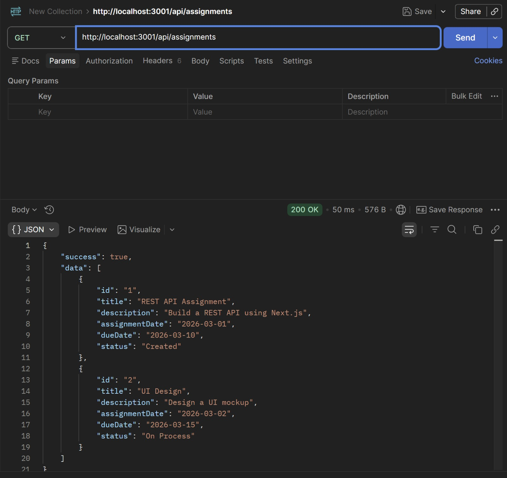 |
| `/api/assignments` | GET | Get all assignments | Error | Server fails | Status: 500 `{ success: false, message: "Server error" }` | Unable to test | Skipped | N/A |
| `/api/assignments` | POST | Create new assignment | Success | `{ title, dueDate }` | Status: 201 `{ success: true, data: { id, title, description, assignmentDate, dueDate, status } }` | `{ "success": true, "data": { "id": "3", "title": "Math Homework", "description": "Complete exercises", "assignmentDate": "2026-03-05", "dueDate": "2026-03-20", "status": "Created" } }` | Passed | 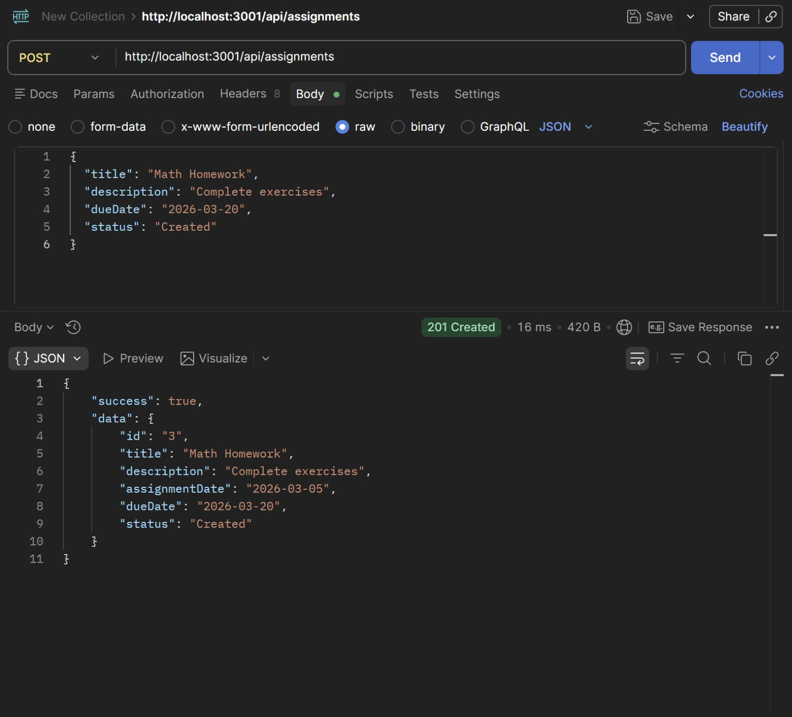 |
| `/api/assignments` | POST | Create new assignment | Error | Missing `title` | Status: 400 `{ success: false, message: "title and dueDate are required" }` | `{ "success": false, "message": "title and dueDate are required" }` | Passed | 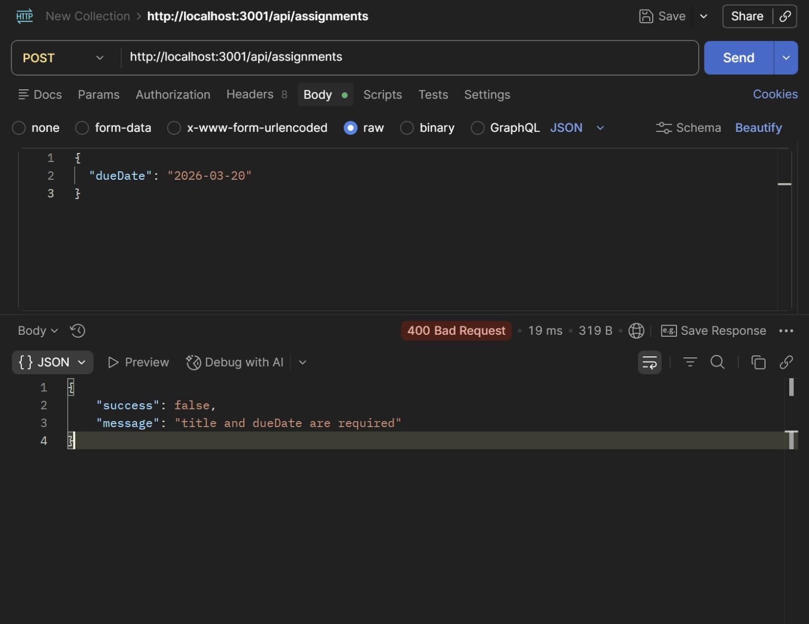 |
| `/api/assignments` | POST | Create new assignment | Error | Missing `dueDate` | Status: 400 `{ success: false, message: "title and dueDate are required" }` | `{ "success": false, "message": "title and dueDate are required" }` | Passed | 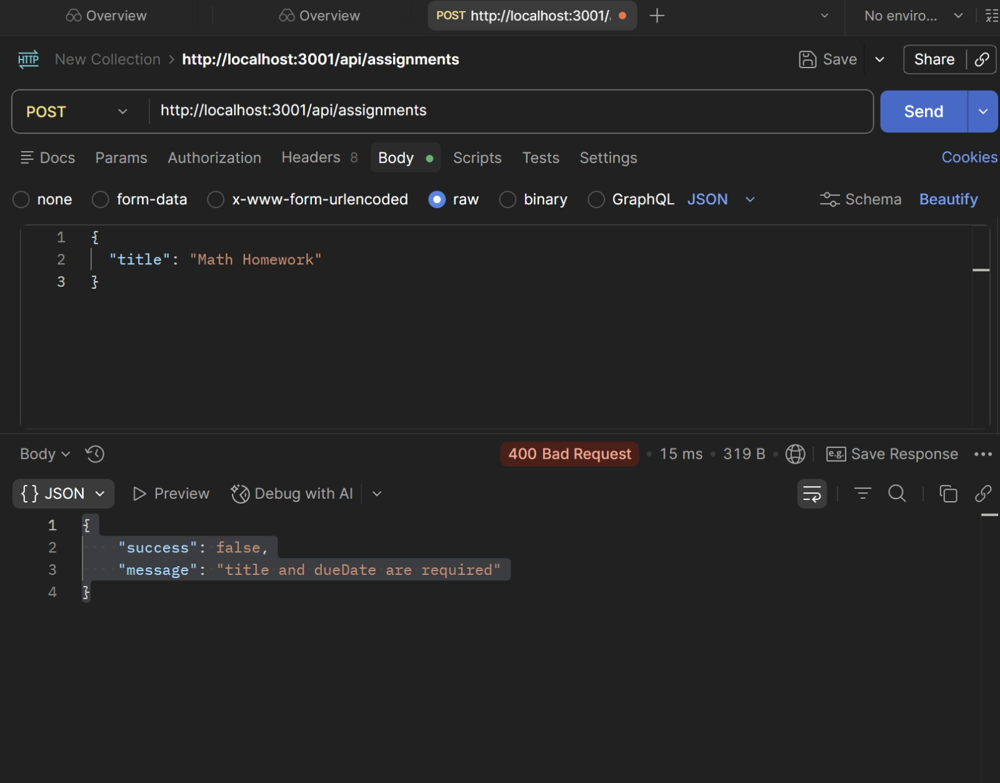 |
| `/api/assignments` | POST | Create new assignment | Error | Invalid `status` | Status: 400 `{ success: false, message: "status must be one of: Created, On Process, Submitted" }` | `{ "success": false, "message": "status must be one of: Created, On Process, Submitted" }` | Passed | 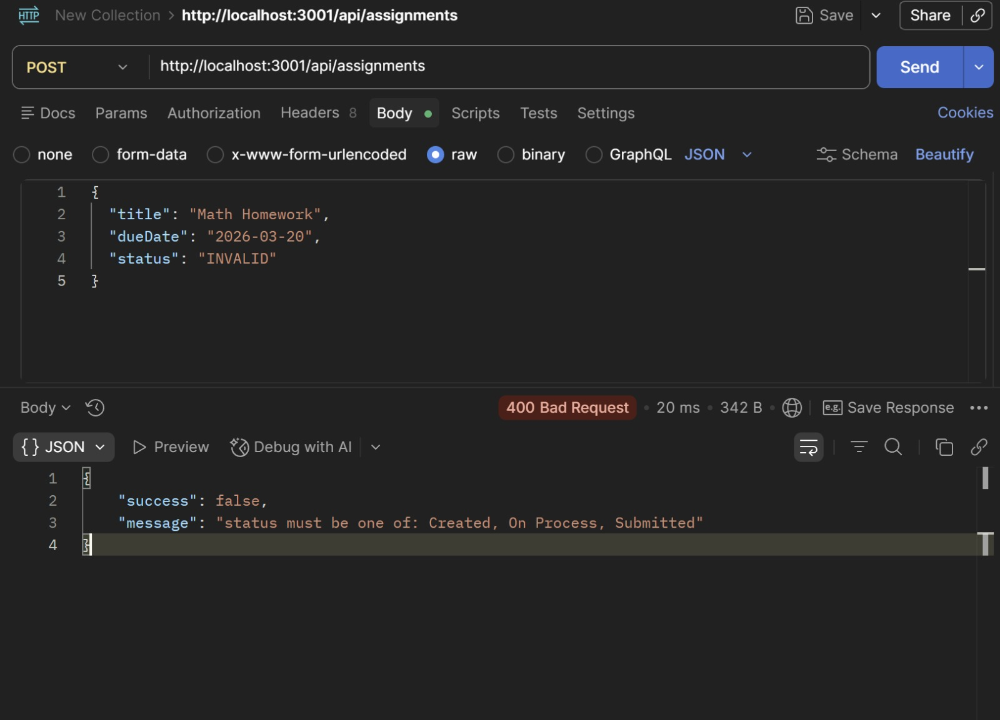 |
| `/api/assignments/:id` | GET | Get assignment by ID | Success | Valid ID | Status: 200 `{ success: true, data: { id, title, ... } }` | `{ "success": true, "data": { "id": "1", "title": "REST API Assignment", "description": "Build a REST API using Next.js", "assignmentDate": "2026-03-01", "dueDate": "2026-03-10", "status": "Created" } }` | Passed | 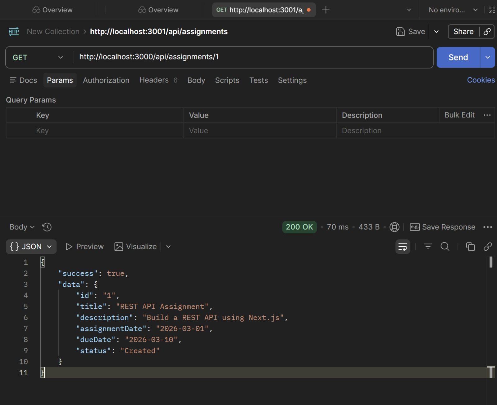 |
| `/api/assignments/:id` | GET | Get assignment by ID | Error | Invalid ID | Status: 404 `{ success: false, message: "Assignment not found" }` | `{ "success": false, "message": "Assignment not found" }` | Passed | 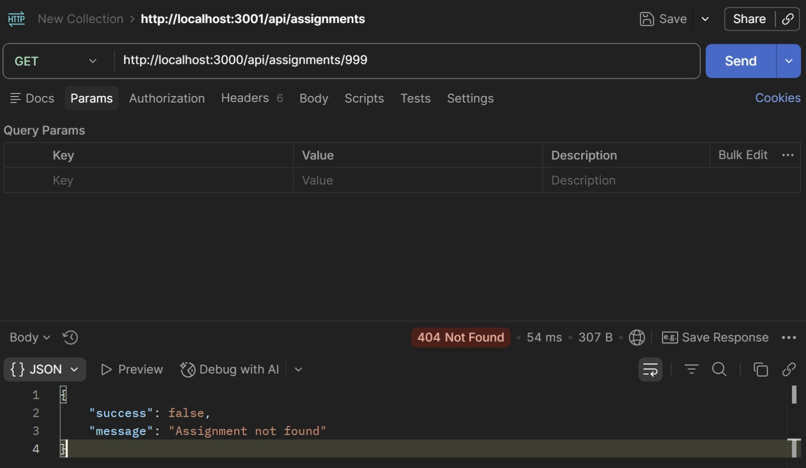 |
| `/api/assignments/:id` | PUT | Update assignment | Success | Valid ID + body | Status: 200 `{ success: true, data: { id, title, ... } }` | `{ "success": true, "data": { "id": "1", "assignmentDate": "2026-03-01", "status": "On Process" } }` | Passed | 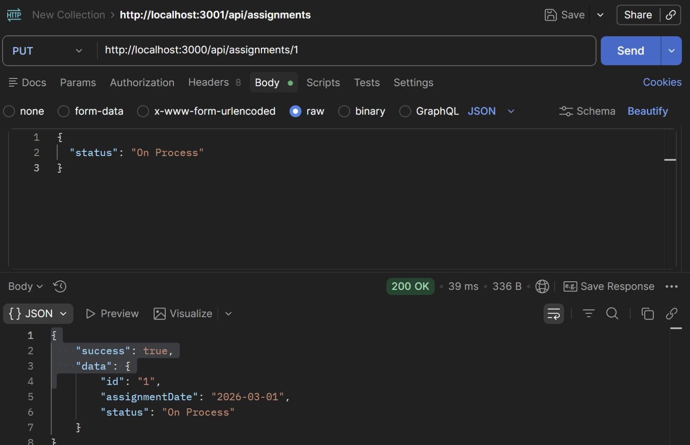 |
| `/api/assignments/:id` | PUT | Update assignment | Error | Invalid ID | Status: 404 `{ success: false, message: "Assignment not found" }` | `{ "success": false, "message": "Assignment not found" }` | Passed | 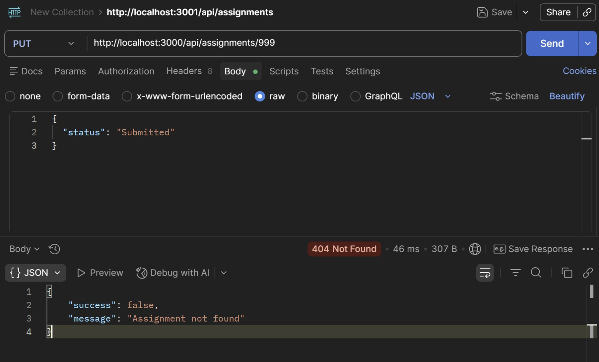 |
| `/api/assignments/:id` | PUT | Update assignment | Error | Invalid `status` | Status: 400 `{ success: false, message: "status must be one of: Created, On Process, Submitted" }` | `{ "success": false, "message": "status must be one of: Created, On Process, Submitted" }` | Passed | 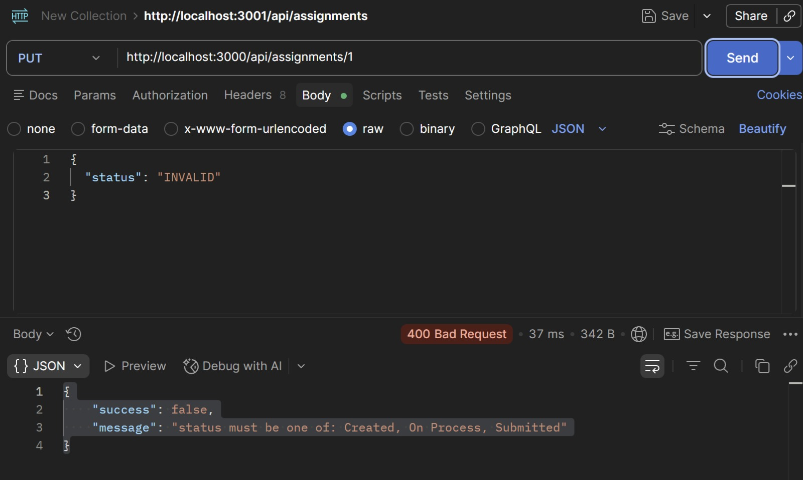 |
| `/api/assignments/:id` | DELETE | Delete assignment | Success | Valid ID | Status: 200 `{ success: true, message: "Assignment deleted" }` | `{ "success": true, "message": "Assignment deleted" }` | Passed | 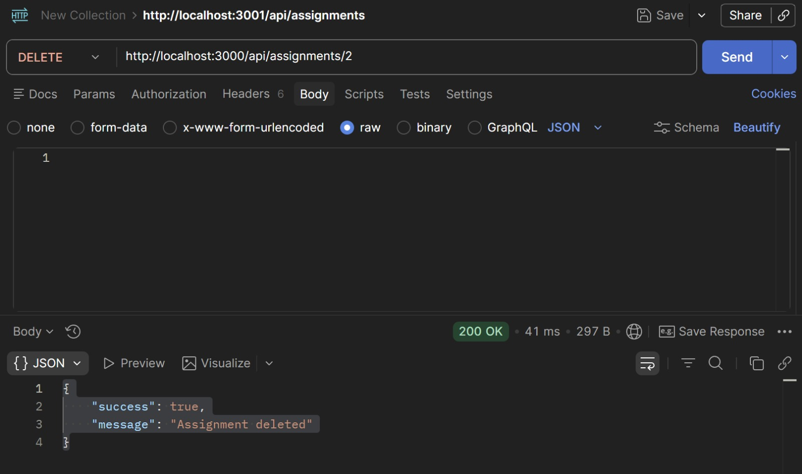 |
| `/api/assignments/:id` | DELETE | Delete assignment | Error | Invalid ID | Status: 404 `{ success: false, message: "Assignment not found" }` | `{ "success": false, "message": "Assignment not found" }` | Passed | 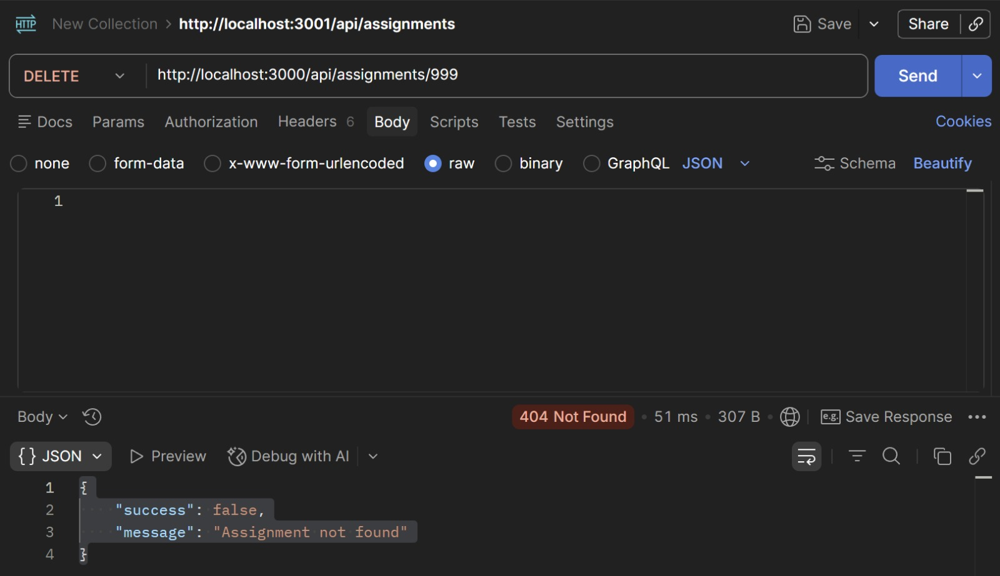 |

## Getting Started

```bash
npx create-next-app@latest vickel-assignment-logbook --typescript
cd vickel-assignment-logbook
npm install swagger-ui-react swagger-jsdoc next-swagger-doc
npm run dev
```

## Swagger Docs
Visit: [http://localhost:3000/api-docs](http://localhost:3000/api-docs)